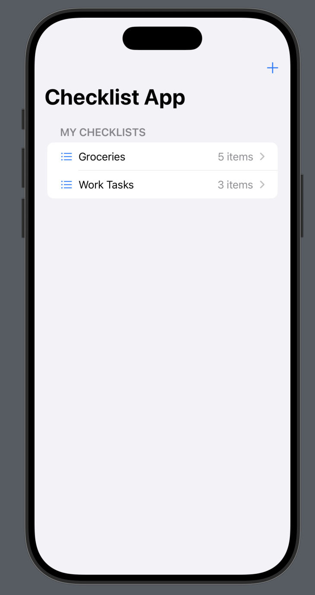
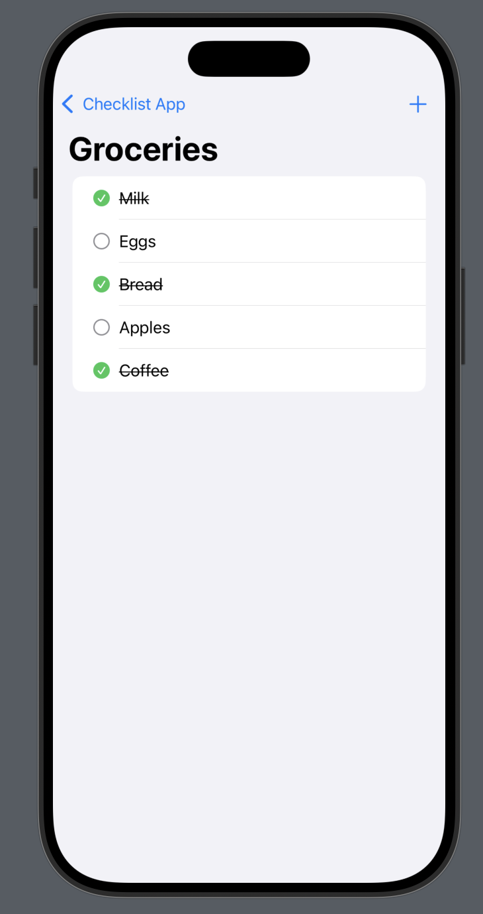
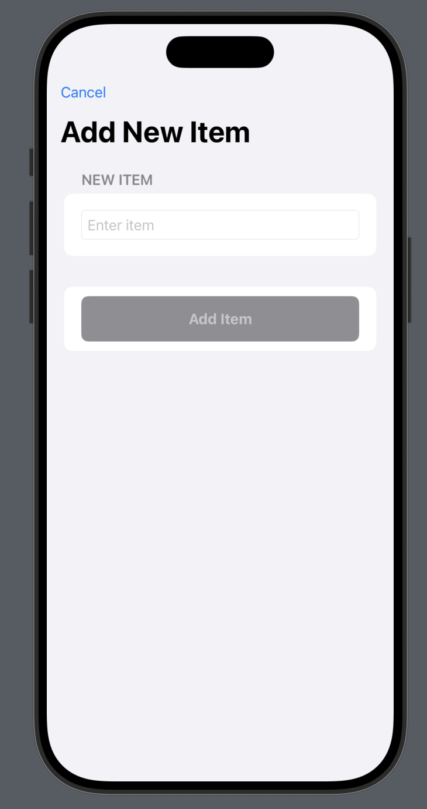

# ✅ Checklist App - CSC 680 Final Project

## 👥 Team Members(Studend ID)
- Ting Feng (922992561)
- Hugo Gomez  
- Jacob Torres  (921890447)
- Yonatan Leake    

## 📱 Project Description
The **Checklist App** is a productivity application that helps users organize tasks efficiently. It enables users to create, manage, and track completion of checklist items with **local data persistence**. The app demonstrates core iOS development competencies including:

- SwiftUI framework  
- MVVM architecture  
- Local data persistence (UserDefaults/CoreData)  
- Multi-screen navigation  
- State management  

## 🎯 Project Goals
- Build a functional, polished app to showcase in professional portfolios  
- Demonstrate mastery of iOS development concepts covered in class  
- Solve a real productivity problem with clean, maintainable code  
- Implement best practices in UI/UX design  

## ✅ Must-Have Features
- [ ] Create and manage multiple checklists  
- [X] Add/edit/delete checklist items  
- [X] Mark items as complete/incomplete  
- [X] Data persistence using CoreData  
- [X] Clean, intuitive UI with smooth animations  

## ✨ Nice-to-Have Features
- [ ] Due Dates & Sorting  
- [ ] Dark/Light mode toggle  
- [ ] Checklist sharing functionality  
- [ ] Reorder items  
- [ ] Custom checklist icons/colors  

## 🛠️ Technology Stack
- Swift  
- SwiftUI  
- CoreData  
- Xcode 16+  
- iOS 18+  

## 📊 Milestone Progress

### Milestone 1: Project Setup *(In Progress)*
- [x] GitHub repository created  
- [x] Project proposal finalized  
- [ ] Wireframes created  
- [ ] Development environment configured  

### Milestone 2: Prototype *(In Progress)*
- [ ] CoreData model implemented  
- [ ] Basic UI for all must-have features  
- [ ] ViewModel architecture established  
- [ ] Data persistence working  

### Milestone 3: Final Submission
- [ ] All must-have features implemented  
- [ ] Code review and optimization  
- [ ] Final testing and bug fixes  
- [ ] Possible in-class presentation  
- [ ] Documentation completed  

## 🎨 Wireframes
  
*Home screen showing all checklists*

  
*Checklist items with completion toggle*

  
*Form for adding new items*

## ⏱️ Time Estimates & Progress Tracking

| Feature                  | Estimated Time | Actual Time | Status       |
|--------------------------|----------------|-------------|--------------|
| CoreData Model Setup     | 3 hours        | -           | In Progress  |
| Main Checklist View      | 4 hours        | -           | In Progress  |
| Item Management          | 3 hours        | -           | In Progress  |
| Data Persistence         | 3 hours        | -           | In Progress  |
| UI Polish & Animations   | 5 hours        | -           | In Progress  |
| Due Dates                | 2 hours        | -           | Pending      |

**Total Estimated Time:** 20 hours  
**Current Time Invested:** *TBD*

## 🏗️ Technical Implementation

### Architecture
- **MVVM Pattern**: Separation of concerns between views and business logic  
- **ObservableObject**: ViewModels trigger UI updates  
- **CoreData**: Robust local storage solution  
- **Modular Components**: Reusable SwiftUI views  

### Key Components
- `ChecklistView`: Main screen displaying all checklists  
- `ChecklistDetailView`: Individual checklist management  
- `AddItemView`: Form for new items  
- `ChecklistViewModel`: Manages business logic and data  
- `PersistenceController`: Handles CoreData operations  
